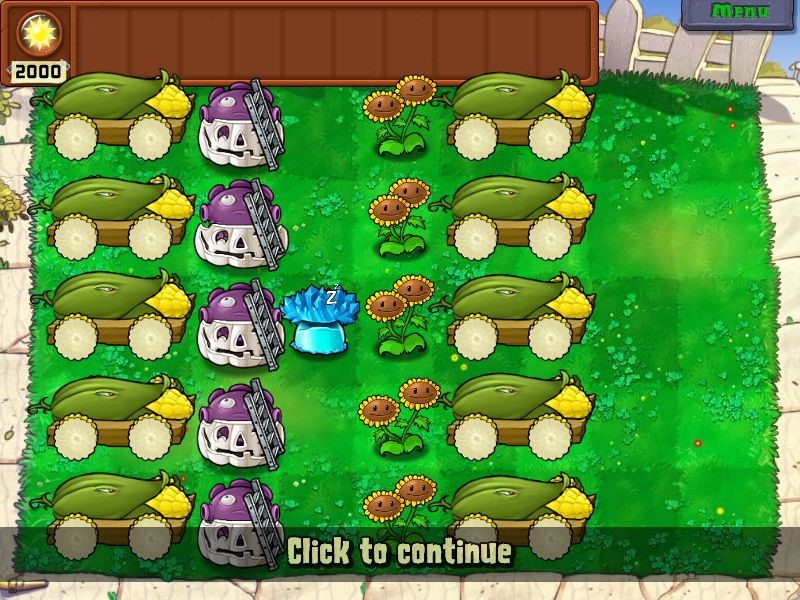
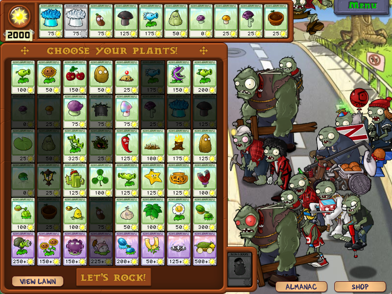
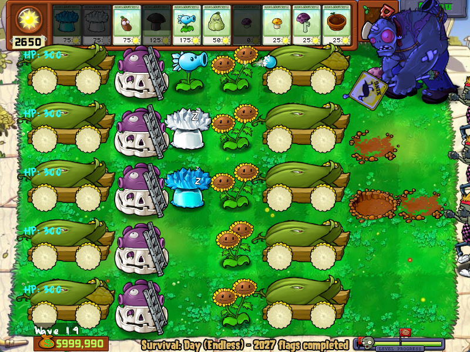
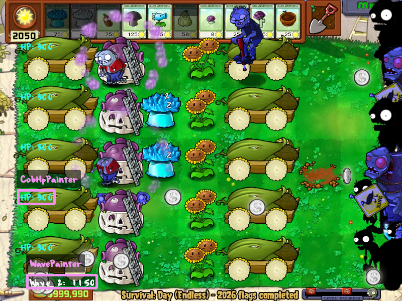

# DE. 准超前置10炮

[返回目录](../README.md)

## 阵设



主要采用 `ch5` 节奏：
```
PP|IPP-PP|IPP-PP (601, 1438, 1438)
```

完整的2F规划如下：
```
1  |2    |3  |4     |5  |6     |7     |8  |9     
PP |IPP-N|PP |IPP-PP|PP |IPP-PP|IPP-PP|PP |IPP-PP
601|1150 |601|1438  |601|1438  |1438  |601|NaN   

10 |11   |12 |13    |14 |15    |16    |17 |18    |19
PP |IPP-N|PP |IPP-PP|PP |IPP-PP|IPP-PP|PP |IPP-PP|IPP-PP
601|1150 |601|1438  |601|1438  |1438  |601|1438  |NaN
```

|波次|操作|时间|
|---|---|---|
|W1|PP|601|
|W2|IPP-N|1150|
|W3|PP|601|
|W4|IPP-PP|1438|
|W5|PP|601|
|W6|IPP-PP|1438|
|W7|IPP-PP|1438|
|W8|PP|601|
|W9|IPP-PP|NaN|
|W10|PP|601|
|W11|IPP-N|1150|
|W12|PP|601|
|W13|IPP-PP|1438|
|W14|PP|601|
|W15|IPP-PP|1438|
|W16|IPP-PP|1438|
|W17|PP|601|
|W18|IPP-PP|1438|
|W19|IPP-PP|NaN|

我在 `ch5` 的基础上在 `W2`、`W11` 插入了**核代奏** `IPP-N`，这个波长 `1150` 取的是毁灭菇不被早爆丑炸掉的最大波长。

核代奏在这里可以减少冰的使用，使开局1个存冰就足够供应。然而这并没有什么卵用，因为完全可以开局有2个甚至3个存冰，阵型的 `(2,4)`、`(3,4)`、`(4,4)` 都可以看作安全存冰位，所以其实完全没有必要插入核代奏。

我对这个构型的理解：**不要存在两个连续的加速波**即可，否则
- 小鬼可能啃底线炮
- 小鬼可能把存冰吃掉
- 6列炮可能被砸

### 选择你的植物/僵尸



```cpp
ASetZombies({ACG_3, AWW_8, ABC_12, AXC_15,AKG_17, ATT_18, ABJ_20, AFT_21, ATL_22, ABY_23,AHY_32, AQQ_16});

ASelectCards({AHBG_14, AM_HBG_14, AKFD_35, AHMG_15, AHBSS_5, AWG_17, AXPG_8, AYGG_9, ADXG_13, AHP_33});
```
寒冰射手用于 `W9/W19/W20` 的收尾，可以显著减少垫巨人的压力，实际上只带3垫也没问题。没有测试只带双垫的效果。


## 脚本实现

[脚本文件](./de_semi_front_10_cobs.cpp)

### 自动垫巨人

`FodderManager` 类实现了自动垫巨人的功能，底层的实现细节抄了 [vector-wlc 经典2炮](https://github.com/vector-wlc/AsmVsZombies/blob/master/tutorial/scripts/jing_dian_2/jing_dian_2.cpp)。

```cpp
class FodderManager
```

其包含的主要调用方法包括：
- `void startBlockGargantuar(int row, float column)`: 开启线程在指定的行、列位置垫红眼僵尸
- `void stopBlockGargantuar()`: 停止垫红眼僵尸线程

成员列表 `fodders` 包含了选卡中可以用的垫材，优先使用索引较小的垫材，比如小喷菇 `APUFF_SHROOM` 放在第0个。注意列表最后还写了一个窝瓜 `ASQUASH`，这是考虑到巨人较多的情况，如果当前需要垫巨人而没有垫材可用时，窝瓜会直接充当垫材同时杀死巨人。

```cpp
std::vector<APlantType> fodders = {APUFF_SHROOM, ASUN_SHROOM, ASCAREDY_SHROOM, AFLOWER_POT, ASQUASH};
```

### 自动收尾

`FinalWaveHandler` 类实现了 `W9/W19/W20` 自动收尾的功能，它的主要作用是根据场上红眼僵尸的行分布决定植物种植的位置。

```cpp
class FinalWaveHandler
```

主要调用方法包括 `start()`、`stop()`、`exit()`。其中 `start()` 和 `stop()` 在某一波某一时刻的**连接中调用**，`exit()` 在退出状态钩中调用，以应对用户在线程调用期间退出游戏的情况。

`giga` 是一个动态的红眼僵尸列表，当在某个连接中遍历该列表可以直接获取当前时刻场上存活僵尸的信息。
```cpp
AAliveFilter<AZombie> giga;
```

这里用于统计每行路上红眼僵尸的个数：
```cpp
int giga_count[7] = {0};

void countGiga() {
    for (int i = 0; i < 7; ++i) {
        giga_count[i] = 0;
    }

    for (auto& zombie : giga) {
        if (zombie.AtWave() + 1 == wave) {
            int row = zombie.Row() + 1;
            giga_count[row] += 1;
        } 
    }
}
```

调用 `start()` 时，在线程中调用 `countGiga()` 统计每行红眼个数后，优先在第1、5路中选择**W9红眼数量大于0且数量较小的那一路**，将该行下标赋值给 `target_row`。如果1、5路都没有W9刷新的红眼，则直接启动女仆秘籍，利用存活的舞王僵尸拖时间。

```cpp
void start() {
    // 启动线程确定收尾路
    giga_runner.Start([this] {
        countGiga();

        // 在1、5路中挑选更优的收尾路
        int giga1 = giga_count[1];
        int giga5 = giga_count[5];

        if (giga1 == 0 && giga5 == 0) {
            // 因为1、5路均无本波红眼，所以一开始就用女仆秘籍
            // 把舞王控制在炮击范围之外拖时间
            dancer_cheat = true;
            AMaidCheats::Dancing();
            giga_runner.Stop();
            return;  
        } else if (giga1 > 0 && giga5 > 0) {
            target_row = (giga1 < giga5) ? 1 : 5;  
        } else if (giga1 > 0) {
            target_row = 1; 
        } else if (giga5 > 0) {
            target_row = 5; 
        }
        giga_runner.Stop();
    });
    // 通过获取的 "target_row" 值进行后续操作
}
```

比如在下图的情况下，`target_row` 被赋值为 `1`，则选择垫第1路的红眼巨人拖时间。这一波1路只有一个红眼，显然选择1路是最稳妥的。



### 绘制类

`Painter` 类定义了绘制方法，它的子类 `WavePainter` 和 `CobHpPainter` 分别实现了绘制当前波次、绘制指定玉米炮生命值的功能。实现非常简单。

```cpp
class Painter
```

